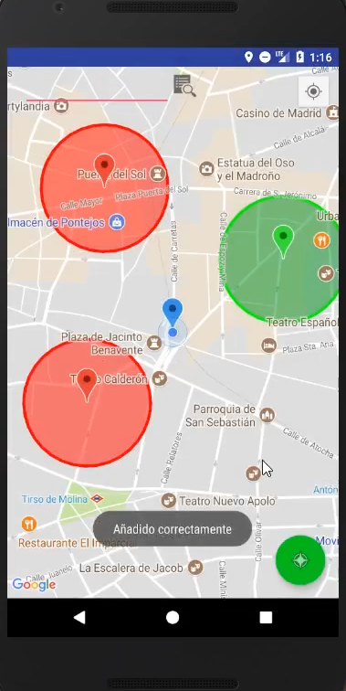
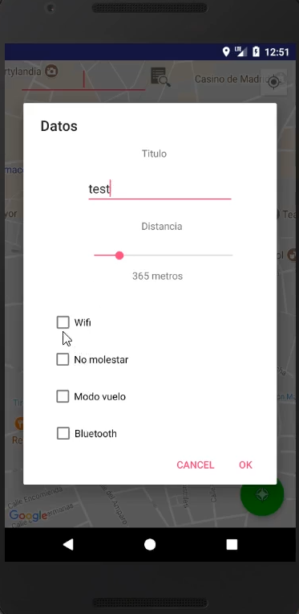

# tareapp
Aplicación para Android que permite crear alarmas/tareas basadas en la posición del usuario

Podemos mostrar un simple recordatorio de texto o habilitar/deshabilitar el bluetooth, wifi, modo silencio o modo vuelo de nuestro dispositivo una vez accedamos al área definida en el mapa.

